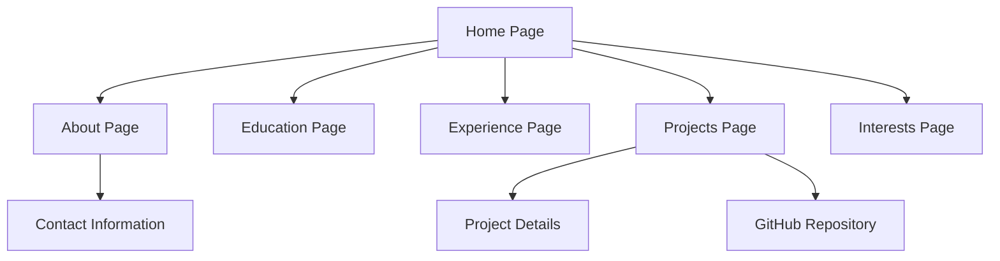

# Data Science Portfolio Website - Product Requirements Document

## 1. Product Overview
A modern, responsive personal portfolio website designed specifically for a data science undergraduate student to showcase academic achievements, projects, and professional development.

The website serves as a comprehensive digital presence that highlights technical skills, educational background, and data science projects to potential employers, academic institutions, and professional networks. The platform is designed for easy content management and customizable styling to adapt as the student's career progresses.

## 2. Core Features

### 2.1 User Roles
This is a single-user portfolio website with no user authentication required. The site owner (student) manages content through direct code editing.

### 2.2 Feature Module
Our data science portfolio consists of the following main pages:
1. **Home page**: hero section with introduction, navigation menu, quick overview of key achievements
2. **About page**: personal introduction, skills overview, contact information
3. **Education page**: academic background, coursework, certifications, GPA (optional)
4. **Experience page**: internships, work experience, research positions, volunteer work
5. **Projects page**: data science projects showcase with descriptions, technologies used, and links
6. **Interests page**: personal interests, hobbies, extracurricular activities

### 2.3 Page Details

| Page Name | Module Name | Feature description |
|-----------|-------------|---------------------|
| Home page | Hero section | Display name, title, professional photo, and compelling tagline |
| Home page | Navigation menu | Responsive navigation bar with smooth scrolling to sections |
| Home page | Quick highlights | Brief overview of key achievements and skills |
| About page | Personal introduction | Detailed biography, career objectives, and personality |
| About page | Skills showcase | Technical skills with proficiency levels (Python, R, SQL, etc.) |
| About page | Contact information | Email, LinkedIn, GitHub, and other professional links |
| Education page | Academic background | University details, degree program, expected graduation |
| Education page | Coursework | Relevant courses with descriptions and grades (optional) |
| Education page | Certifications | Professional certifications and online course completions |
| Experience page | Work experience | Internships, part-time jobs, and research positions |
| Experience page | Achievements | Notable accomplishments and recognition |
| Experience page | Timeline | Chronological view of professional development |
| Projects page | Project showcase | Individual project cards with images and descriptions |
| Projects page | Technology tags | Filter projects by programming languages and tools |
| Projects page | Project details | Links to GitHub repositories, live demos, and documentation |
| Interests page | Personal interests | Hobbies, sports, and non-academic activities |
| Interests page | Community involvement | Volunteer work and extracurricular activities |

## 3. Core Process

**Main User Flow:**
1. Visitor lands on home page and sees professional introduction
2. Visitor navigates through sections using the main menu
3. Visitor explores education background and academic achievements
4. Visitor reviews work experience and professional development
5. Visitor examines data science projects and technical capabilities
6. Visitor learns about personal interests and cultural fit
7. Visitor contacts the student through provided contact information

## 4. User Interface Design

### 4.1 Design Style
- **Primary colors**: Medium purple (#7C3AED), soft white (#FEFEFE)
- **Secondary colors**: Light purple (#C4B5FD), dark purple (#5B21B6), light gray (#F3F4F6)
- **Button style**: Rounded corners with subtle shadows and hover effects
- **Font**: Modern sans-serif (Inter or similar), 16px base size, 24px headings
- **Layout style**: Clean card-based design with generous white space and top navigation
- **Icons**: Minimalist line icons for social media and skills

### 4.2 Page Design Overview

| Page Name | Module Name | UI Elements |
|-----------|-------------|-------------|
| Home page | Hero section | Large centered content with gradient background, professional photo, animated text |
| Home page | Navigation | Fixed top navigation bar with purple accent, smooth scroll animations |
| About page | Skills showcase | Progress bars or skill cards with purple accent colors |
| Education page | Academic timeline | Vertical timeline with purple markers and card layouts |
| Experience page | Experience cards | Horizontal cards with company logos and purple borders |
| Projects page | Project grid | Responsive grid layout with hover effects and purple call-to-action buttons |
| Interests page | Interest categories | Icon-based cards with purple backgrounds and white text |

### 4.3 Responsiveness
The website is mobile-first and fully responsive, optimized for desktop, tablet, and mobile viewing. Touch interactions are optimized for mobile users with appropriate button sizes and spacing.