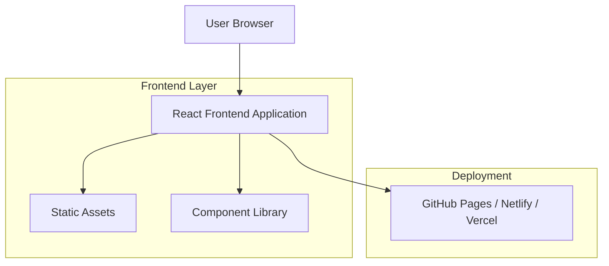

# Data Science Portfolio Website - Technical Architecture Document

## 1. Architecture Design



## 2. Technology Description

- Frontend: React@18 + TypeScript + Tailwind CSS@3 + Vite
- Styling: Tailwind CSS with custom purple color palette
- Icons: Lucide React or React Icons
- Animations: Framer Motion (optional)
- Deployment: Static hosting (GitHub Pages, Netlify, or Vercel)

## 3. Route Definitions

| Route | Purpose |
|-------|---------|
| / | Home page with hero section and navigation |
| /about | About page with personal introduction and skills |
| /education | Education background and academic achievements |
| /experience | Work experience and professional development |
| /projects | Data science projects showcase |
| /interests | Personal interests and hobbies |

## 4. Component Architecture

### 4.1 Core Components

**Layout Components:**
- `Header`: Navigation bar with responsive menu
- `Footer`: Contact information and social links
- `Layout`: Main layout wrapper with consistent styling

**Page Components:**
- `HomePage`: Hero section with introduction
- `AboutPage`: Personal details and skills showcase
- `EducationPage`: Academic background display
- `ExperiencePage`: Professional experience timeline
- `ProjectsPage`: Project cards with filtering
- `InterestsPage`: Personal interests grid

**Reusable Components:**
- `Card`: Reusable card component for consistent styling
- `Button`: Styled button with purple theme
- `SkillBar`: Progress bar for skill proficiency
- `ProjectCard`: Individual project display card
- `TimelineItem`: Timeline component for education/experience

### 4.2 Data Structure

**Content Configuration:**
```typescript
// types/content.ts
export interface PersonalInfo {
  name: string;
  title: string;
  email: string;
  phone?: string;
  location: string;
  bio: string;
  profileImage: string;
  socialLinks: SocialLink[];
}

export interface SocialLink {
  platform: string;
  url: string;
  icon: string;
}

export interface Skill {
  name: string;
  level: number; // 1-100
  category: 'programming' | 'tools' | 'frameworks' | 'other';
}

export interface Education {
  id: string;
  institution: string;
  degree: string;
  field: string;
  startDate: string;
  endDate: string;
  gpa?: number;
  coursework?: string[];
  achievements?: string[];
}

export interface Experience {
  id: string;
  company: string;
  position: string;
  startDate: string;
  endDate: string;
  description: string;
  achievements: string[];
  technologies: string[];
}

export interface Project {
  id: string;
  title: string;
  description: string;
  longDescription: string;
  technologies: string[];
  githubUrl?: string;
  liveUrl?: string;
  imageUrl: string;
  featured: boolean;
}

export interface Interest {
  id: string;
  title: string;
  description: string;
  icon: string;
  category: string;
}
```

## 5. Styling System

### 5.1 Color Palette Configuration

```typescript
// tailwind.config.js
module.exports = {
  theme: {
    extend: {
      colors: {
        primary: {
          50: '#F5F3FF',
          100: '#EDE9FE',
          200: '#DDD6FE',
          300: '#C4B5FD',
          400: '#A78BFA',
          500: '#8B5CF6', // Main purple
          600: '#7C3AED', // Primary purple
          700: '#6D28D9',
          800: '#5B21B6',
          900: '#4C1D95',
        },
        secondary: {
          50: '#FEFEFE',
          100: '#F9FAFB',
          200: '#F3F4F6',
          300: '#E5E7EB',
          400: '#9CA3AF',
          500: '#6B7280',
          600: '#4B5563',
          700: '#374151',
          800: '#1F2937',
          900: '#111827',
        }
      }
    }
  }
}
```

### 5.2 Content Management

**Easy Content Updates:**
- All content stored in `src/data/` directory as TypeScript/JSON files
- Separate files for each section: `personal.ts`, `education.ts`, `experience.ts`, `projects.ts`, `interests.ts`
- Color customization through Tailwind config file
- Image assets organized in `public/images/` directory

**File Structure:**
```
src/
├── components/
│   ├── layout/
│   ├── ui/
│   └── sections/
├── data/
│   ├── personal.ts
│   ├── education.ts
│   ├── experience.ts
│   ├── projects.ts
│   └── interests.ts
├── pages/
├── types/
└── styles/
```

## 6. Deployment Strategy

### 6.1 Static Site Generation
- Build optimized static files using Vite
- Deploy to GitHub Pages, Netlify, or Vercel
- Automatic deployment on git push to main branch
- Custom domain support available

### 6.2 Performance Optimization
- Code splitting for optimal loading
- Image optimization and lazy loading
- Responsive images for different screen sizes
- Minimal bundle size with tree shaking